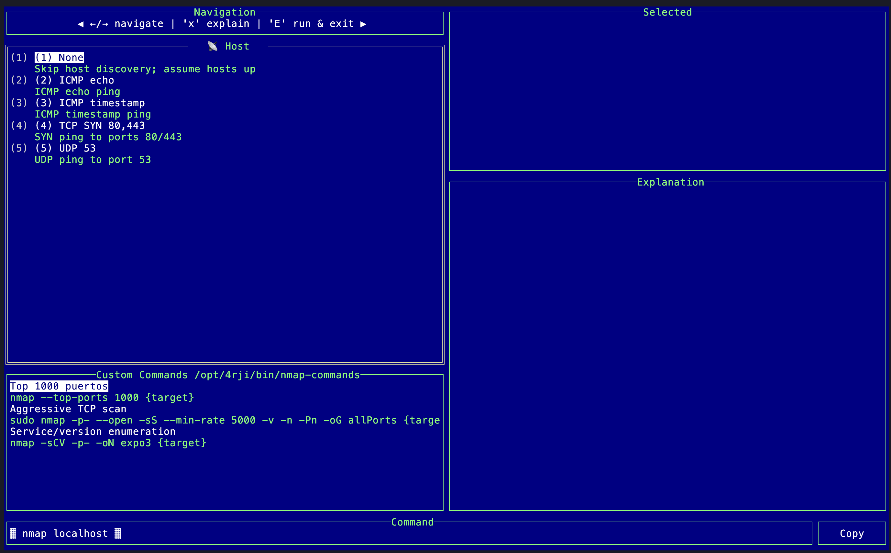
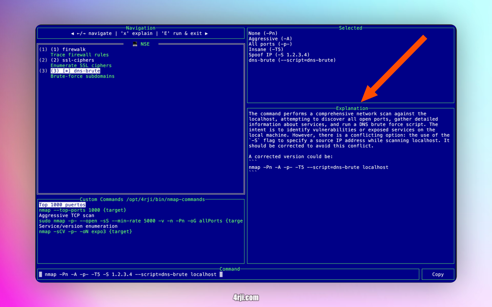
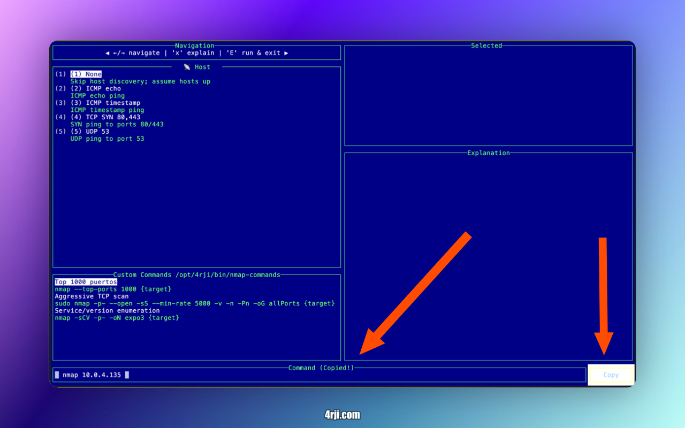
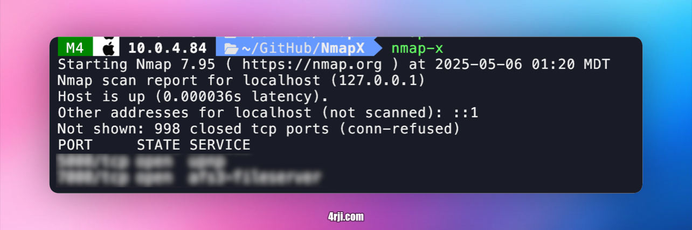

# NmapX - Interactive Nmap Scanner

NmapX is an interactive command-line tool that provides a user-friendly interface for running Nmap scans with various options and features.

## Quick Start

You can run NmapX in two ways:

```sh
# Basic usage
go run nmapX.go

# With target specification
go run nmapX.go IP/subnet
```

## Interactive Menu Navigation

### Main Navigation


- Use **left and right arrow keys** to navigate between different scan options
- Press **Tab** to switch to the "Custom commands" section

### Custom Commands


- Save and manage frequently used commands
- Press **X** to get AI-powered explanations of commands using ChatGPT API

### Command Copy


- Press **Tab** again to access the command copy feature

### Command Execution


- Use **Shift + E** to execute the selected command directly

**Install Go dependencies:**
   ```sh
   go mod tidy
   ```
### Format of nmap-commands

Service/version enumeration::nmap -sCV -p- -oN expo3 {target}

### ChatGPT API Setup

To use the AI-powered command explanations feature, you need to add your OpenAI API key to your shell configuration:

```sh
# Add to ~/.zshrc or ~/.bashrc
export OPENAI_API_KEY=sk-proj-EG_EC2NLaXhHhI..................USuE$
```

After adding the API key, restart your terminal or run:
```sh
source ~/.zshrc  # or source ~/.bashrc
```

For all methods, replace `<CIDR>` with your target network (e.g., `192.168.1.0/24` or `10.0.4.0/24`).

Note: Running with `sudo` is required because nmap needs root privileges to perform certain types of scans.

